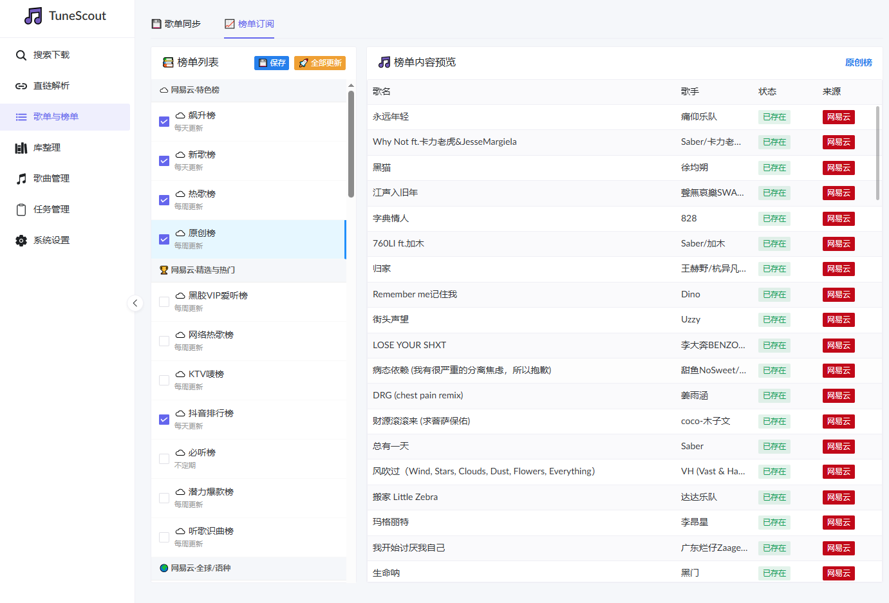
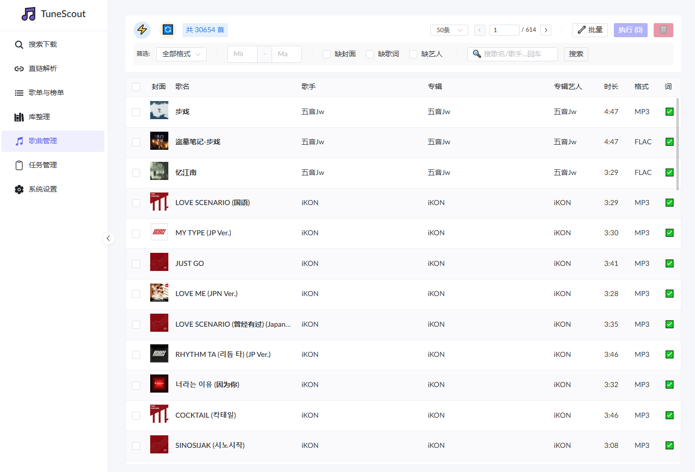
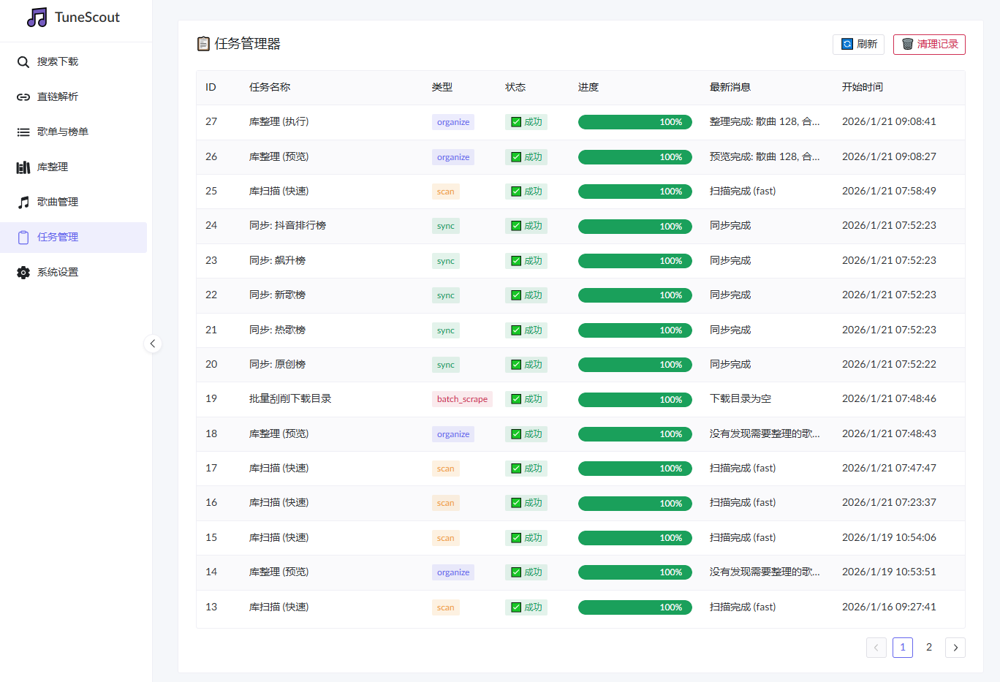

# 🎵 TuneScout

**TuneScout** 是一个强大的、一体化的本地音乐库管理与自动化工具。它旨在成为 Navidrome服务器的最佳伴侣。

通过现代化的 Web 界面，您可以轻松实现音乐下载、元数据刮削、自动整理、歌单同步以及后台任务管理，让您的音乐库始终保持井井有条。



## ✨ 核心功能

* **🌐 多源音乐下载**
    * 支持从 **网易云音乐**、**QQ音乐**、**酷我音乐**、**Bilibili** (提取音频) 及 **YouTube** 下载高品质音乐。
    * 智能解析搜索，支持按歌手、歌名、链接进行精准匹配。
* **🏷️ 智能元数据刮削**
    * 自动补全歌曲的 **封面**、**歌词**、**歌手**、**专辑**、**流派** 等信息。
    * 支持从网易云、QQ、酷我、咪咕等多个源头聚合搜索，匹配率极高。
    * 支持批量修复本地缺失封面或歌词的音频文件。
* **📂 自动化库整理**
    * **标准化目录结构**：自动将散乱的音频文件整理为 `歌手/专辑/歌曲.mp3` 结构。
    * **智能合集处理**：自动识别并提取多人合作曲目（Feat./Vs.）和群星合集，避免歌手目录过于杂乱。
    * **空目录清理**：自动检测并删除整理后留下的空文件夹。
* **📑 歌单与榜单同步**
    * **云歌单同步**：一键订阅网易云/QQ音乐的歌单或排行榜。
    * **本地映射**：自动检测本地已存在的歌曲，仅下载缺失部分，并生成标准的 `.m3u8` 播放列表文件（完美支持 Navidrome）。
    * **定时任务**：支持 Cron 表达式，后台定时自动同步订阅的榜单。
* **⚡ 高效任务管理**
    * **并发处理**：支持多任务并发执行（如下载、同步），互不阻塞。
    * **可视化进度**：实时查看任务进度、状态（运行中/成功/失败）及详细日志。
    * **Cron 调度**：内置强大的定时任务调度器，支持时区（TZ）感知。
* **🔒 安全与部署**
    * **Web 安全认证**：支持基于环境变量的 Basic Auth 登录保护，安全暴露于公网。
    * **Docker 部署**：开箱即用，支持 Docker Compose 一键部署。

## 📸 界面预览

### 歌曲管理
提供强大的筛选器（时长、格式、缺封面/歌词检测）和批量操作功能。


### 任务管理
清晰的任务队列与实时进度追踪。


## 🚀 快速开始 (Docker Compose)

推荐使用 Docker Compose 进行部署。

### 1. 创建 `docker-compose.yaml`

```yaml
version: '3'
services:
  tunescout:
    image: your-repo/tunescout-pro:latest
    container_name: tunescout
    environment:
      - TZ=Asia/Shanghai            # 设置时区，确保定时任务准确
      - WEB_USERNAME=admin          # Web界面登录用户名 (可选, 默认 admin)
      - WEB_PASSWORD=yourpassword   # Web界面登录密码 (设置后自动开启认证)
      - PUID=1000                   # (可选) 设置运行用户ID
      - PGID=1000                   # (可选) 设置运行组ID
    volumes:
      - ./config:/app/config        # 配置文件存储路径 （需构建容器前手动在该位置创建同名空文件）
      - ./library_cache.db:/app/library_cache.db  # 数据库文件持久化  （需构建容器前手动在该位置创建同名空文件）
      - /path/to/your/music:/music  # 本地音乐库目录
      - /path/to/download:/download # 临时下载目录
      - /path/to/playlists:/playlists # 歌单文件输出目录  （navidrome相应挂载- /path/to/playlists:/music/Playlists）
      # 如果需要自动重启 Navidrome，请挂载 docker socket (可选)
      # - /var/run/docker.sock:/var/run/docker.sock 
    ports:
      - "8503:8503"
    restart: unless-stopped
```
### 3. 访问

在浏览器中访问 `http://你的IP:8503` 即可进入管理界面。
如果设置了 `WEB_PASSWORD`，首次访问会提示输入账号密码。

## ⚙️ 配置说明

您可以在 Web 界面的“系统设置”中修改配置，或直接编辑 `/app/config/config.json`。

| 配置项 | 说明 | 默认值 |
| :--- | :--- | :--- |
| `download_sources` | 启用的下载源列表 | `["netease", "kuwo", "qq", "bilibili", "youtube"]` |
| `audio_quality` | 下载音质偏好 (`lossless`, `high`) | `high` |
| `match_threshold` | 元数据匹配相似度阈值 | `85` |
| `leaderboard_cron` | 榜单同步的 Cron 表达式 | `0 2 * * 1` |
| `organize_cron` | 自动整理库的 Cron 表达式 | `0 5 * * *` |
| `org_multi_artist_enabled` | 是否启用多人合作曲归类 | `True` |

## 🛠️ 开发与构建

本项目后端基于 **FastAPI**，前端基于 **Vue 3** + **Naive UI**。

### 后端
```bash
pip install -r requirements.txt
python main.py
```
### 前端
```bash
cd frontend
npm install
npm run dev
```
## ⚠️ 免责声明

1.  本项目仅供**个人学习、技术研究和本地音乐库整理**使用。
2.  本项目**不提供**任何具体的音乐文件下载服务，所有数据来源均为公开互联网接口或用户自行配置的源。
3.  用户在使用本项目时，请务必遵守当地法律法规及相关版权规定。**严禁将本项目用于任何商业用途或非法传播版权内容。**
4.  开发者不对用户使用本项目产生的任何后果负责。

---

## ☕ 请作者喝杯咖啡

如果觉得 TuneScout Pro 对您有帮助，欢迎打赏支持后续开发与维护！❤️

<div align="center">
  <table style="border: none;">
    <tr>
      <td align="center" style="border: none;">
        <br>
        <strong>微信支付</strong>
      </td>
      <td width="50" style="border: none;"></td> <td align="center" style="border: none;">
        <br>
        <strong>支付宝</strong>
      </td>
    </tr>
  </table>
  
  <p>感谢您的支持！您的鼓励是我更新的最大动力。</p>
</div>

---

**TuneScout Pro** © 2024 Created by You. Released under the [MIT License](LICENSE).
